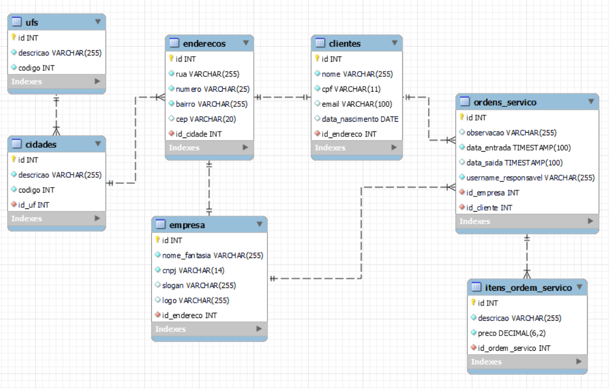

# Assistência técnica

Projeto desenvolvido em Java com o gerenciador de projetos Maven para realizar operações em um banco de dados PostgreSQL de uma assistência técnica.

## Operações

Por meio deste projeto, é possível realizar as seguintes operações para cada tabela no banco de dados:

- `COUNT`: count()
- `INSERT`: insert(Object entity)
- `UPDATE`: update(Object entity)
- `DELETE`: delete(id)
- `SELECT`: select(id)
- `SELECT *`: selectAll(Integer id)

## Diagrama entidade-relacionamento

O diagrama foi projetado na ferramenta MySQL Workbench e pode ser acessado [aqui](./eer_diagram).

## Tecnologias
- Java
- Maven
- PostgreSQL
- MySQL Workbench
